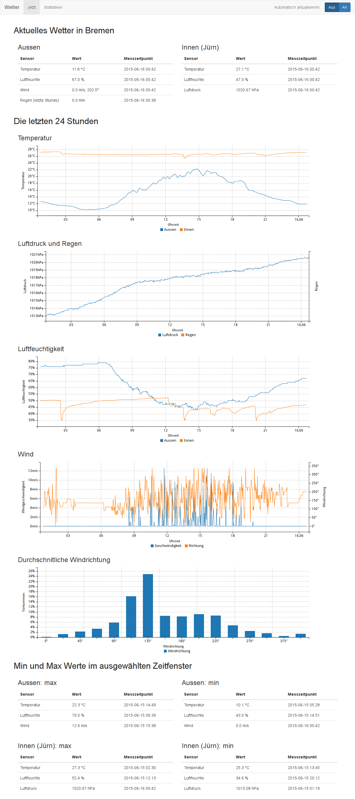

# decode_ws2308
## Was ist decode_ws2308?
decode\_ws sammelt Wetterdaten von einer Wetterstation (La Crosse WS-2308) deren Daten über einen rtl\_sdr kompatiblen USB-Stick empfangen wurden.
Außerdem werden Innenraum Daten durch einen arduino gemessen.
Die gesammelten Daten werden in einer webapp visualisiert.

## Benutzung
### Vor dem ersten Start:
Kopiere "app.conf.example" nach "app.conf"
### Start das Programm

```
$ cd WORKING_DIR
$ python stream.py
$ python wetter_app.py
```

`stream.py` zeichnet die Daten auf und `wetter_app.py` startet die webapp.

Für die Statistiken wird außerdem ein cronjob benötigt der alle 24h die Datei `weather_avg.py` ausführt.

## Dependencies
* python3
* python3-cherrypy
* python3-pyserial
* python3-numpy
* python3-mako
* rtl_fm

## Screenshot


##JS, CSS, Fonts, Icons distributed with this release
* [Bootstrap](http://getbootstrap.com/)
* [GLYPHICONS](http://glyphicons.com/)
* [jQuery](https://jquery.com/)
* [OpenIconic](https://useiconic.com/open)
* [D3.js](http://d3js.org/)
* [C3.js](http://c3js.org/)
